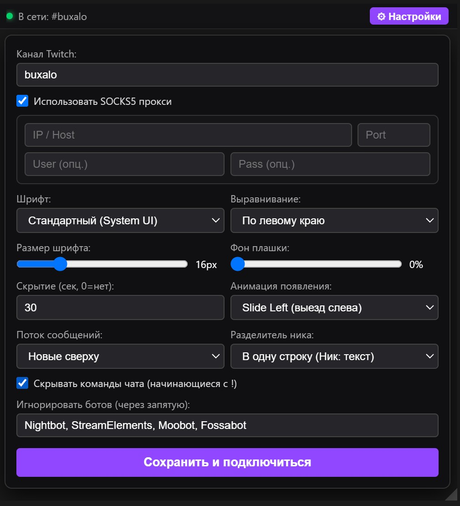

# Twitch Transparent Chat Overlay

Минималистичный, легковесный и полностью прозрачный оверлей чата Twitch поверх любых окон и игр. Не требует OAuth-авторизации, подключается напрямую по IRC/TLS через анонимный аккаунт Justinfan и не нагружает систему во время стрима.
<p align="center">
  
</p>


## ⚠️ Важно: настройка игр для работы оверлея

Чтобы оверлей отображался поверх игры, переведите игру в настройках графики в режим **«В окне без рамки» (Borderless Windowed / Borderless Fullscreen)**.

В классическом полноэкранном режиме (**Exclusive Fullscreen**) видеокарта забирает вывод игры монопольно в обход оконного менеджера Windows (DWM), поэтому стандартные прозрачные окна поверх нее вывести невозможно.

---

## Возможности

* **Абсолютная прозрачность и сквозной режим**: окно удерживается на уровне `screen-saver`, оставаясь поверх borderless-окон. По нажатию Ctrl+Alt+F9 включается сквозной клик (Ignore Mouse Events) — оверлей перестает перехватывать курсор, скрывает шапку управления и не мешает геймплею.
* **Четкая читаемость в игре**: встроенная внешняя многовекторная обводка (`text-shadow`) предотвращает искажение шрифта и обеспечивает контраст даже на ярких игровых сценах.
* **Родные смайлы и бейджи**: рендеринг официальных бейджей Twitch (Broadcaster, Mod, VIP, Sub и др.) и смайлов по кодовым точкам Unicode без сдвига позиций.
* **Сторонние смайлы 7TV, BetterTTV и FrankerFaceZ**: глобальные и смайлы канала (ID канала берётся из `room-id`), поддержка анимированных и zero-width смайлов. Если включён SOCKS5, смайлы и их картинки загружаются через прокси, иначе напрямую.
* **Тестовое сообщение**: кнопка в настройках показывает примеры (бейджи, смайлы, награда, `/me`) без подключения к чату, а параметры вида применяются сразу.
* **Иконка в трее**: показать/скрыть оверлей, сквозной режим, настройки, скрытие с панели задач, выход.
* **Два языка интерфейса**: English (по умолчанию) и Русский, переключение в настройках без перезапуска.
* **Корректная обработка `/me`**: сообщения действия (`\x01ACTION ...\x01`) автоматически очищаются, окрашиваются цветом ника автора и не сбивают индексы смайлов.
* **Кастомная типографика**: выбор шрифтов (Inter, Montserrat, Roboto, Impact или системный UI), регулировка размера, фона плашки и выравнивания текста.
* **Маркировка наград за баллы канала**: автоматический перехват наград с текстовым вводом (`custom-reward-id`), тонкая золотая боковая линия и отображение иконки баллов канала.
* **Защита от утечек памяти**: настраиваемое время скрытия сообщений, а также лимит сообщений в DOM (150 шт.) при отключенном таймере (`0 сек`), предотвращающий просадки FPS на длинных стримах.
* **Поддержка SOCKS5**: встроенный клиент с авторизацией по логину и паролю для обхода сетевых блокировок.
* **Фильтры чата**: скрытие команд (начинающихся с `!`) и фильтрация ботов по настраиваемому списку (Nightbot, StreamElements и др.).
* **Надежная сеть**: экспоненциальный backoff при сбоях, сторожевой таймер (Watchdog на 60 сек), отработка планового реконнекта Twitch (`RECONNECT`) и таймауты TLS/TCP.

---

## Управление

| Элемент | Действие |
| :--- | :--- |
| **`Ctrl+Alt+F9`** | Переключение сквозного игрового режима (клик сквозь чат в игру) |
| **Правый нижний угол** | Маркер для изменения размера окна (в режиме настройки) |
| **Кнопка «⚙ Настройки»** | Панель конфигурации канала, языка, прокси, шрифтов и анимаций |
| **Иконка в трее** | Клик: показать/скрыть оверлей. Правая кнопка: сквозной режим, настройки, скрыть с панели задач, выход |

---

## Где хранятся настройки

Конфигурация, позиция и размеры окна не сбрасываются при перезапуске и сохраняются платформонезависимо через `electron-store`:

* **Windows**: `%APPDATA%\TwitchOverlay\config.json`  
  *(полный путь: `C:\Users\<Имя_Пользователя>\AppData\Roaming\TwitchOverlay\config.json`)*
* **Linux**: `~/.config/TwitchOverlay/config.json`
* **macOS**: `~/Library/Application Support/TwitchOverlay/config.json`

---

## Стек технологий

* **Runtime**: Electron
* **Платформа**: Node.js
* **Сетевой уровень**: `tls`, `net`, `https`, `socks` (SOCKS5), парсер Twitch IRC v3 tags, API 7TV / BTTV / FFZ
* **Хранилище данных**: `electron-store`
* **Сборка**: `electron-builder` (NSIS Portable)

---

## Установка и запуск в dev-режиме

1. Склонируйте репозиторий и перейдите в папку проекта:
   ```bash
   git clone https://github.com/BuXaLo/TwitchTransparentChat.git
   cd TwitchTransparentChat
   ```

2. Установите зависимости:
   ```bash
   npm install
   ```

3. Запустите приложение:
   ```bash
   npm start
   ```

---

## Сборка Portable .exe

Для сборки исполняемого файла, не требующего установки Node.js:

1. Запустите команду сборщика:
   ```bash
   npm run dist
   ```

2. Готовый файл появится в папке `dist/`:
   ```text
   dist/TwitchOverlay 1.0.0.exe
   ```

> **Примечание**: При первом запуске исполняемого файла без платного цифрового сертификата Windows SmartScreen может показать синее окно с предупреждением. Нажмите **«Подробнее»** → **«Выполнить в любом случае»**.
