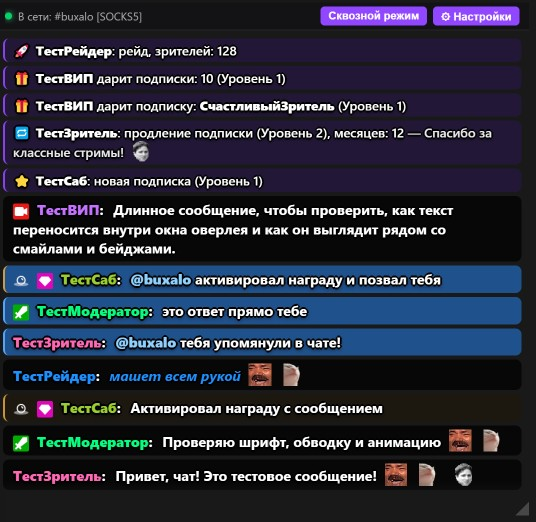

<p align="center">
  <a href="README.md">English</a> | <b>Русский</b>
</p>

# Twitch Transparent Chat Overlay

Минималистичный, легковесный и полностью прозрачный оверлей чата Twitch поверх любых окон и игр. Не требует входа в аккаунт: подключается к чату анонимно и почти не нагружает систему во время стрима. Тот же чат можно вывести на трансляцию как виджет для OBS.

<p align="center">
  
</p>

> **Режим отображения игры.** Чтобы оверлей был виден поверх игры, включите в ней **«Окно без рамки»** (Borderless Windowed или Borderless Fullscreen). В классическом **Exclusive Fullscreen** видеокарта обходит композитор Windows, и обычное окно поверх нарисовать нельзя.

---

## Возможности

**Оверлей**
* Полностью прозрачное окно поверх игр в режиме без рамки. **`Ctrl+Alt+F9`** включает сквозной режим: мышь проходит через чат в игру. **`Ctrl+Alt+F11`** скрывает или показывает оверлей.
* Нет кнопки на панели задач и в Alt+Tab, поэтому Win+D его не прячет. Управление через иконку в трее или кнопку **«Сквозной режим»** в шапке окна.
* Запускается в одном экземпляре, а если сохранённая позиция оказалась за пределами экранов, окно возвращается в центр.
* Окно настроек всегда остаётся поверх остальных окон, поэтому не теряется за игрой в режиме без рамки.
* Тонкая фиолетовая рамка обозначает границы окна, пока сквозной режим выключен: так его удобно ставить и растягивать. В сквозном режиме рамка исчезает.

**Чат**
* Официальные бейджи и смайлы Twitch, а также смайлы **7TV, BetterTTV и FrankerFaceZ** (анимированные и zero-width тоже).
* Подсветка упоминаний, ответов и наград за баллы канала. По желанию строки событий: подписки, подарки и рейды. У наград и событий свой неизменный вид (системный шрифт, тёплая плашка награды, компактная фиолетовая строка события), поэтому стили, сохранённые стили и ротация их не меняют. Общими остаются только размер шрифта и выравнивание текста.
* Синхронизация с модерацией: удалённые сообщения, баны, таймауты и `/clear` сразу исчезают из оверлея.
* Фильтры команд `!`, ботов и выбранных пользователей. Сообщения `/me` обрабатываются корректно.
* Надёжное соединение с автопереподключением и необязательный прокси **SOCKS5** (чат, смайлы и проверка обновлений). При быстрой смене канала или прокси запоздавшие события старого соединения больше не попадают в новое.

**Внешний вид**
* **Плашка сообщения**: сплошной фон или градиент в 7 направлениях, скруглённая или прямая форма, рамка с анимированными эффектами (неон, пульс, RGB-сдвиг, бегущий контур, дыхание).
* **Картинка плашки**: слой с картинкой на плашке. Можно выбрать встроенную «наклейку» или загрузить свою (PNG, JPEG или WebP, до 8 МБ; изображения крупнее 1920 px уменьшаются автоматически). Загруженные картинки хранятся как `card-images/<имя>.webp` под заданным вами названием. Перед удалением картинки показывается, где она используется (стили и пользователи), и везде она удаляется только после вашего подтверждения.
* **Анимации появления** с предпросмотром, плавный сдвиг старых сообщений и необязательный режим **«Сплошная лента»**, где плашки затухают только на самой границе.
* **Текст и ники**: цвета, обводка, размер, выравнивание (одна настройка для всех типов сообщений) и 13 шрифтов (лежат в папке `fonts/`, интернет не нужен).
* **Стили и пресеты**: 9 встроенных тем и ваши сохранённые стили, общие для оверлея и виджета OBS. У каждого сохранённого стиля есть кнопка **«Перезаписать»**: она сохраняет текущий вид вкладки под тем же именем (с подтверждением), и **замок**: заблокированный стиль не участвует в ротации и не входит в счётчик «Все мои сохранённые стили». Применять такой стиль и назначать его пользователям по-прежнему можно. При удалении стиля, назначенного пользователям, вас предупредят, у кого останется копия.
* **Стили для пользователей**: назначьте выбранным пользователям Twitch собственный стиль плашки (встроенный или сохранённый). Задаётся отдельно для оверлея и виджета и приоритетнее ротации. Замена и удаление пользователя требуют подтверждения. Если стиль удалён, пользователи сохраняют его копию вместе с картинкой, а кнопка **«Сохранить как стиль»** в списке возвращает копию в сохранённые стили.
* **Ротация стилей**: сообщения по очереди выводятся вашими сохранёнными стилями. У кнопки **«Ротация»** есть индикатор (зелёный, когда ротация включена). При 2 сохранённых стилях они чередуются автоматически; при 3 и более выбираете **«Все мои сохранённые стили»** (новые стили попадают в ротацию сами) или **«Выбрать вручную»** (от 3 до 5 стилей с закреплённым живым превью), по очереди или случайно (без одинаковых стилей подряд). Заблокированные стили не участвуют. Если незаблокированных остаётся меньше 2, ротация выключается и объясняет почему. Награды за баллы канала не перекрашиваются. Упоминания и ответы в виджете стилизуются всегда, а в оверлее только при выключенной опции **«Подсвечивать упоминания и ответы»**.
* Живой предпросмотр в каждом окне настроек (в том числе под кнопкой **«Проиграть анимацию»**: он всегда показывает текущие стиль, окантовку и раскладку) и кнопки **«Сбросить по умолчанию»**. Сброс целой вкладки сначала просит подтверждения.

**Удобство**
* Настройки в отдельном окне в тёмном оформлении: **Общие**, **Оверлей**, **Виджет для OBS**. Параметры сгруппированы по понятным разделам (на вкладке «Общие»: «Подключение», «Фильтрация», «Запуск», «Приложение»), а переключатель языка **EN | RU** находится в строке вкладок.
* Кнопка **«Сохранить»** и строка состояния в футере: **● Есть несохранённые изменения** или **✓ Все изменения сохранены**. Неверный порт виджета ловится до сохранения, а курсор ставится в это поле.
* Кнопка **«Проверить соединение»** под полями SOCKS5 проверяет прокси до сохранения.
* Всплывающие уведомления внутри окна настроек (обработка, загрузка, переименование и удаление картинки) вместо системных окон-предупреждений.
* Диалоги, удобные для клавиатуры: Tab не выходит за пределы открытого окна, а фокус возвращается на кнопку, которая его открыла. Подсказки появляются и тогда, когда опция получает фокус с клавиатуры.
* Кнопки тестовых сообщений проигрывают все типы сообщений без подключения к чату.
* Проверка обновлений с описанием релиза на вашем языке. Текущая версия показана на вкладке «Общие» рядом с кнопкой **«Проверить обновления»**. Выполняется один раз при каждом запуске (и по кнопке), а не в фоне во время игры. Если лимит GitHub API исчерпан, версия берётся из файла релиза. Setup обновляется в один клик, Portable открывает страницу загрузки.
* Ползунок **«Расстояние между плашками»** под настройкой разделителя ника.
* Кнопка **«Скрыть оверлей» / «Показать оверлей»** на вкладке «Оверлей», синхронизированная с меню в трее и горячей клавишей **`Ctrl+Alt+F11`**.
* Небольшая декоративная картинка-маскот занимает свободное место на вкладках «Оверлей» и «Виджет для OBS». Она лежит под элементами управления и не перехватывает клики.
* Автозапуск с Windows, меню в трее, интерфейс на русском и английском (переключатель **EN | RU** в настройках).
* Ненавязчивая ссылка **«Поддержать автора»** внизу вкладки «Общие».

---

## Управление

| Элемент | Действие |
| :--- | :--- |
| **`Ctrl+Alt+F9`** | Включить или выключить сквозной режим |
| **`Ctrl+Alt+F10`** | Открыть настройки |
| **`Ctrl+Alt+F11`** | Скрыть или показать оверлей |
| **Кнопка «Сквозной режим»** | В шапке окна, слева от «Настроек» |
| **⚙ Настройки** | Открывают вкладки «Общие», «Оверлей» и «Виджет для OBS» |
| **Правый нижний угол** | Изменение размера (в режиме настроек) |
| **Иконка в трее** | Показать/скрыть оверлей, сквозной режим, настройки, выход |
| **Кнопка «Скрыть оверлей»** | Вкладка «Оверлей», над кнопкой сброса. Работает как пункт трея и синхронизирована с ним |

> Если `Ctrl+Alt+F9` занят другой программой, рядом с индикатором соединения появится жёлтый ⚠.

---

## Виджет для OBS

Чат можно показывать **только на трансляции** как источник «Браузер» со своим размером и оформлением. По умолчанию виджет выключен.

1. Откройте **Настройки → Виджет для OBS**, включите **«Включить виджет для OBS»** (порт, ссылка и оформление виджета появятся под переключателем) и нажмите **«Сохранить»**. Если порт `8769` занят, смените его.
2. Нажмите **«Копировать ссылку»**.
3. В OBS добавьте источник **«Браузер»**, вставьте ссылку как URL и задайте нужный размер.
4. Нажмите **«Тестовые сообщения (только виджет)»**, чтобы проверить результат. В оверлей они ничего не отправляют.

Виджет использует общие с оверлеем канал, прокси, фильтры и сохранённые стили. В виджете упоминания и ответы показываются как обычный текст.

> **После обновления приложения нажмите Refresh Cache** в свойствах источника «Браузер» в OBS (или перезапустите OBS), чтобы виджет подхватил новые файлы.

---

## Полезно знать

* **Упоминания зависят от имени канала.** Введённый канал также считается именем, которое ищется в `@упоминаниях` и ответах, поэтому подсветка имеет смысл, когда вы смотрите собственный чат.
* **Поле канала** принимает `name`, `#name`, `@name` или ссылку на канал.
* **«Сохранить» переподключается только при необходимости.** Подключение к чату перезапускается, когда меняются канал или настройки прокси. Стили, фильтры и параметры виджета применяются сразу, без разрыва соединения.
* **События приходят из обычного подключения к чату.** Награды без текста, фолловы и сообщения, задержанные AutoMod, без входа в аккаунт недоступны.
* **У окна настроек фиксированная ширина**, поэтому длинные тексты на обоих языках помещаются без горизонтальной прокрутки.
* **Виджет работает только пока запущено приложение** и только на этом компьютере (`127.0.0.1`).
* **Папка настроек.** Вкладка «Общие» показывает её и открывает в один клик.

Настройки хранятся в `%APPDATA%\TwitchOverlay\config.json` (Windows), `~/.config/TwitchOverlay/config.json` (Linux) или `~/Library/Application Support/TwitchOverlay/config.json` (macOS). При запуске из исходников папка называется `twitch-overlay`.

---

## Запуск из исходников

```bash
git clone https://github.com/BuXaLo/TwitchTransparentChat.git
cd TwitchTransparentChat
npm install
npm start
```

## Сборка установщика и portable .exe

```bash
npm run dist
```

*(или `npm run dist:nsis` / `npm run dist:portable` для одной цели)*

Готовые файлы появятся в папке `dist/`, имена берутся из версии в `package.json`:

```text
dist/TwitchOverlay-Setup-x.x.x.exe
dist/TwitchOverlay-Portable-x.x.x.exe
```

> Без платного сертификата подписи Windows SmartScreen может показать предупреждение при первом запуске: нажмите **«Подробнее» → «Выполнить в любом случае»**. Рекомендуется версия **Setup**: она создаёт ярлыки и обновляется в один клик.

---

## Технологии

Electron, Node.js, `electron-store`, `electron-builder` (NSIS и Portable), `electron-updater`, `socks`. Twitch IRC поверх TLS, API 7TV / BTTV / FFZ и локальный HTTP-сервер с SSE для виджета OBS.

## Лицензия

[MIT](LICENSE)
